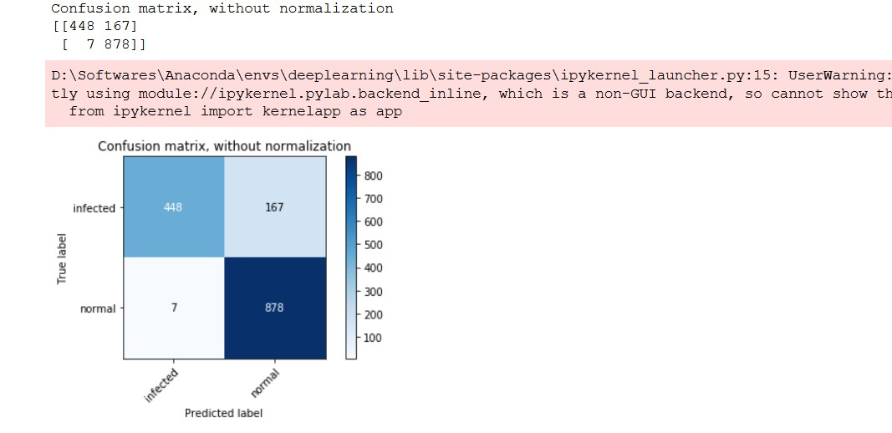
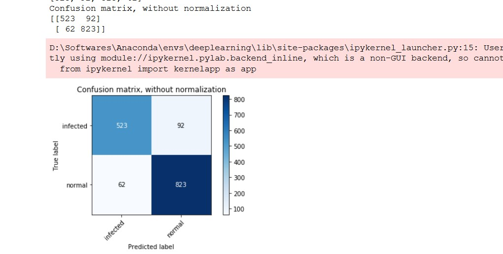
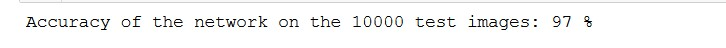
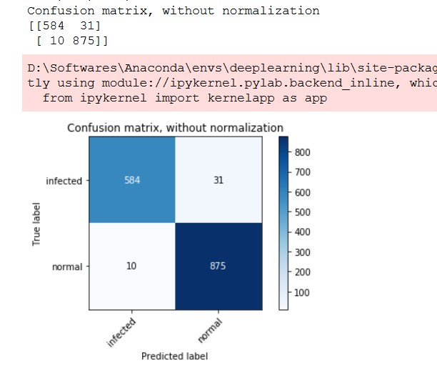
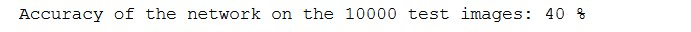
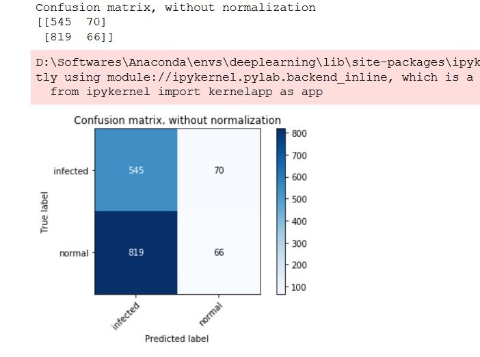

# Dataset
https://drive.google.com/open?id=1-HQQciKYfwAO3oH7ci6zhg45DduvkpnK&authuser=0
# Weights/Saved Models
Pytorch's saved models can be retrieved from here...
https://drive.google.com/drive/folders/1l7vhQ7H7Td2vDE5aBjvFiExHKvr6ptQ4?usp=sharing
# Results
### VGG16 Task 1 Test Accuracy

### VGG16 Task 1 Test Confusion Matrix

### Resnet18 Task 1 Test Accuracy

### Resnet18 Task 1 Test Confusion Matrix

### VGG16 Task 2 Test Accuracy

### VGG16 Task 2 Test Confusion Matrix

### Resnet18 Task 2 Test Accuracy

### Resnet18 Task 2 Test Confusion Matrix

